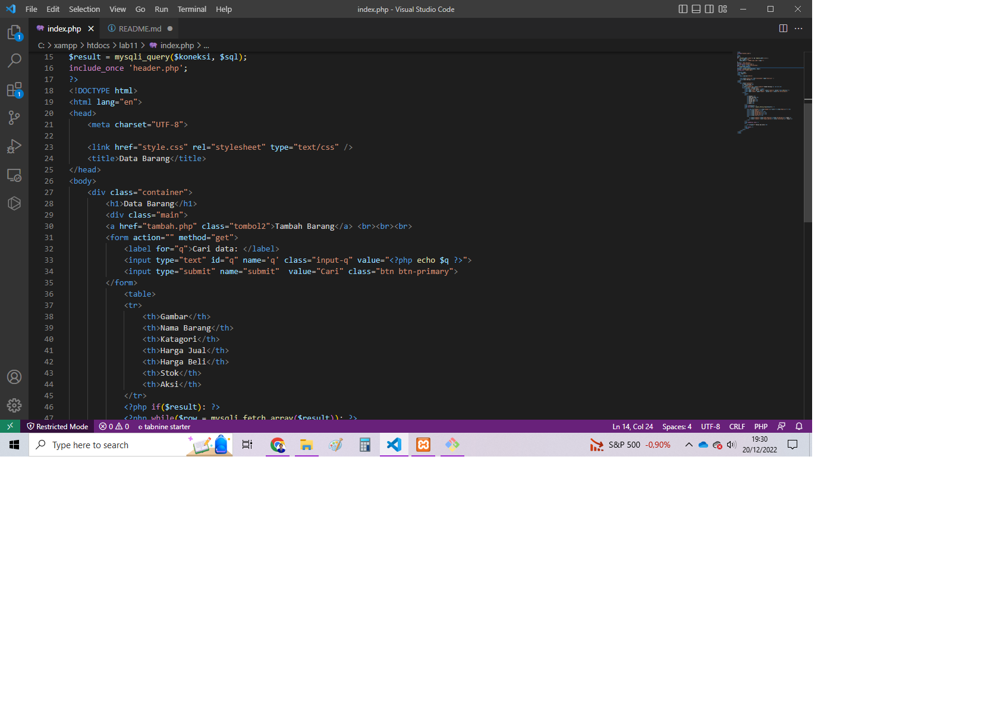
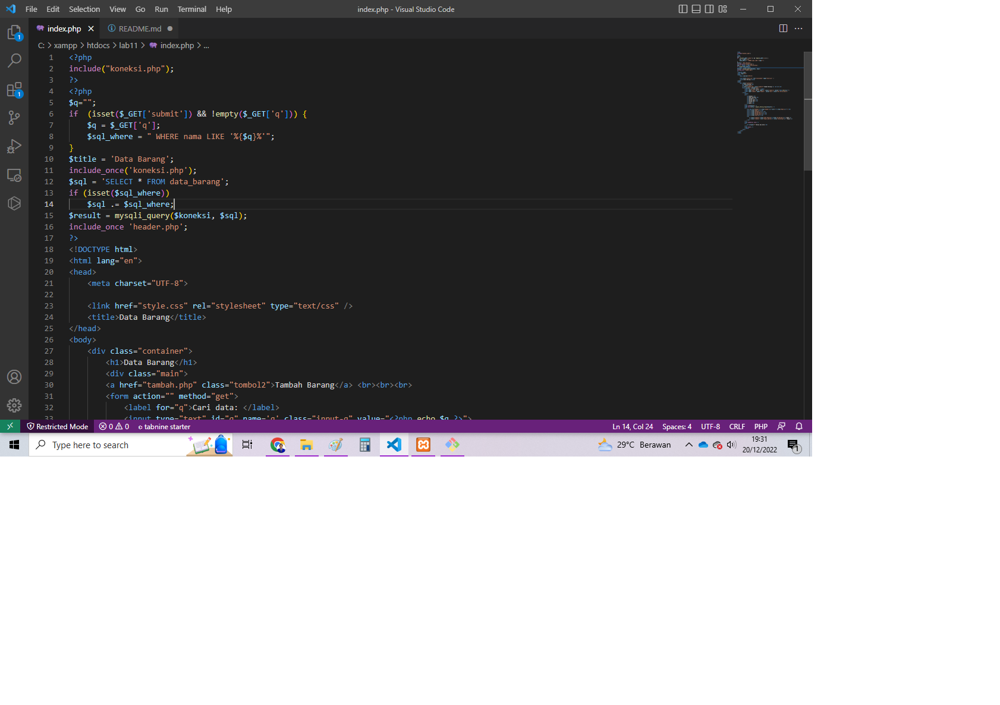
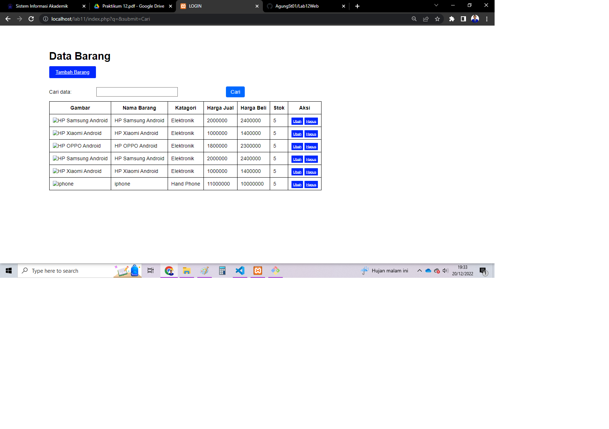
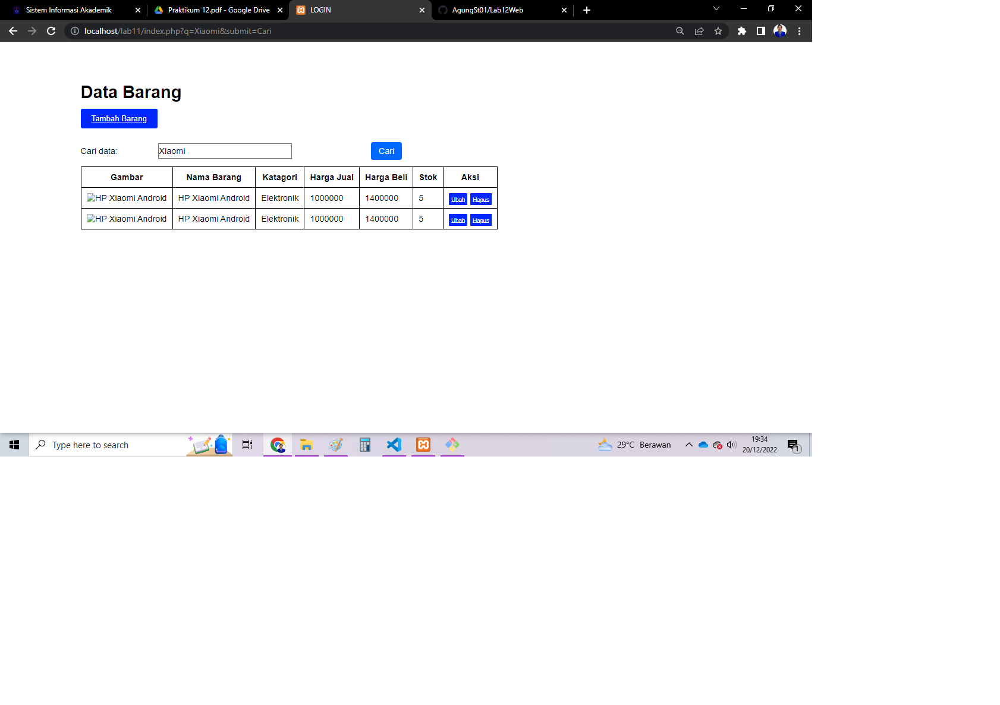

# Lab12Web
## Membuat Pencarian Data

Untuk membuat pencarian data, yang perlu di perhatikan adalah penggunaan filter pada query data.

Pada data awal, query untuk menampilkan semua data adalah:

$sql = “SELECT * FROM data_barang”;

Nah untuk menambahkan pencarian, maka query tersebut harus ditambahkan klausa WHERE sebagai
filter, sehingga menjadi:

$sql = “SELECT * FROM data_barang WHERE nama = ‘{$var_nama}’”;

Atau dapat juga menggunakan LIKE seperti berikut:

$sql = “SELECT * FROM data_barang WHERE nama LIKE ‘{$var_nama}%’”;

### Langkah selanjutnya adalah membuat form pencarian.
Buatlah form pencarian dengan memasukan kode berikut :

Sisipkan kode tersebut pada file index.php (daftar barang), sebelum table data dan sesudah tombol
tambah data.
### Penambahan Filter Pencarian Pada Query
Lalu rubah querynya dan tambahkan filter pencarian pada query tersebut, dengan menambahkan kode berikut :

Maka hasil ouput nya seperti berikut, terdapat button cari dari hasil filter pencarian tadi :

Dan apabila dilakukan pencarian sesuai yang di inginkan maka output nya seperti berikut:

